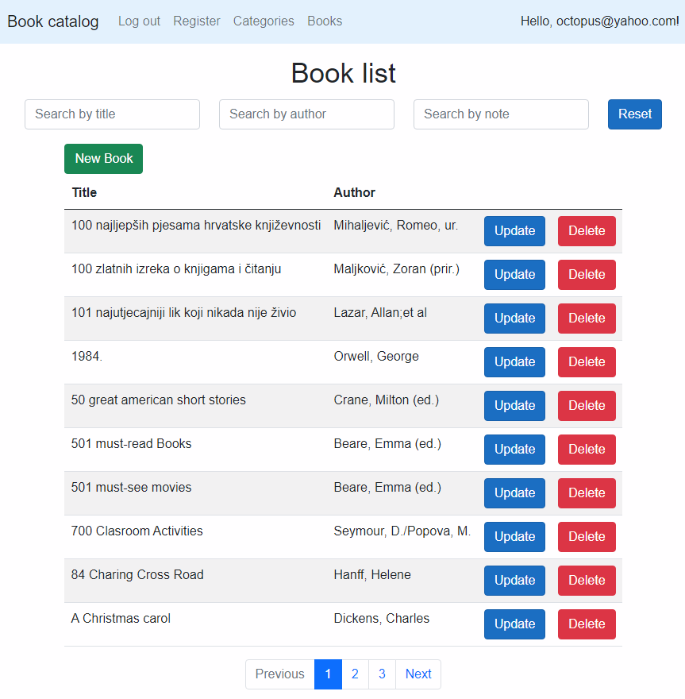

Short overview:
===============

What is this?
-------------

Very simple book catalog web application I created for the purpose of exercise. 

- Web API 
- Blazor client
- Angular client

Live test versions:

- Blazor: https://bookcatalogblzstaging.jadro.space/
- Angular: https://bookcatalogangstaging.jadro.space/

- Username and password for the app should be in my cover letter or proposal

What is utilized?
-------------------

* .NET 5.0 Web API
* MS SQL 2019
* Entity framework 5
* ASP.NET Identity
* Two front-end versions of the same application: Blazor WebAssembly 5 and Angular 12
* Server-side paging and searching
* Twitter-bootstrap 
* Serilog
* Xunit
* Http interceptors
* Angular material

How to run?
-----------

* Clone or download code

* Open solution (Visual studio 2019 or later)

* In the project "BookCatalog.API" => "appsettings.json", change "server name"  in the connection string if needed

* To run the Blazor app:

  * Left click on solution => "Set startup projects"
  * "Multiple startup projects" => "multiple startup projects"
  * Pick two projects: "BookCatalog.API" and "BookCatalog.WebBlz" => "OK"
  * "BookCatalog.WebBlz" proj => left click "libman.json" => "Restore client-side libraries"
  * Start the app (VS play button)
  * When app starts, database is created (migration is executed) with few tables
  * Open the database and execute the sql script from the folder "doc => updateDatabase.sql"
  * Username and password for the app should be in my cover letter or proposal

  

*	To run the Angular app:

  *	From VS run just single project "BookCatalog.API"
  *	Go to the folder "BookCatalog.WebAng" using cmder or powershell 
  *	run "npm install" to install the packages
  *	run "ng serve -o" to run the Angular app
  *	Username and password for the app should be in my cover letter or proposal
  
  

## Work in progress...

- Add custom configuration provider to encrypt  connection string
- Add "Result Pattern", a layer between service and controller which contains the logic of determining if result is eg. "Ok", "Invalid", "Unauthorized" etc. 
  - The point is to remove that logic from controller.
  - https://alexdunn.org/2019/02/25/clean-up-your-client-to-business-logic-relationship-with-a-result-pattern-c/
- There is only few unit tests in the "BookCatalog.API" for now. We could add more unit or integration tests
- Account management module is not finished.
