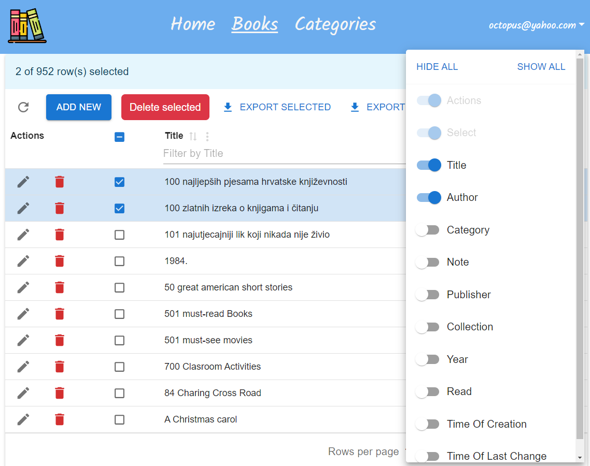

Short overview:
===============

What is this?
-------------

Very simple book catalog web application I created for the purpose of exercise. 
One backend and two different frontend technologies of the same app (Book Catalog app).

- ASP.NET Web API
- React client
- Angular client

What is utilized?
-------------------

* .NET 8 Web API
* MS SQL 2019
* Entity framework 5
* ASP.NET Identity
* Two front-end versions of the same application: Angular 14 and React 18
* Server-side paging, sorting and searching
* Twitter-bootstrap 
* Serilog
* Xunit
* Http interceptors
* Angular material
* @tanstack/react-query
* @mui/material
* material-react-table

How to run?
-----------

* Clone or download code

* Open solution (Visual studio 2019 or later)

* To run the React app:
  - From VS run just single project "BookCatalog.API"
  - When app starts, database is created (migration is executed) with few tables
  - Open the database "BookCatalogWebApi" and execute the sql script from the folder "doc => updateDatabase.sql"
  - Go to the folder "Bookcatalog.WebReact" using cmder or powershell 
  - Run "npm install" to install the packages
    - <strong>If "unable to resolve dependency tree" error arise, then run "npm install --force"</strong>
  - Run "npm start" to run the React app
  - Username and password for the app:
    - username: "octopus@yahoo.com"
    - password: "2xSNzSa$"
      

* To run the Angular app:
  - From VS run just single project "BookCatalog.API"
  - When app starts, database is created (migration is executed) with few tables
  - Open the database "BookCatalogWebApi" and execute the sql script from the folder "doc => updateDatabase.sql"
  - Go to the folder "BookCatalog.WebAng" using cmder or powershell 
  - run "npm install" to install the packages
    - <strong>if "unable to resolve dependency tree" error arise, then run "npm install --force"</strong>
  - run "ng serve -o" to run the Angular app
    - <strong>if "...digital envelope routines::unsupported" error arise, then run "set NODE_OPTIONS=--openssl-legacy-provider"</strong>
  - Username and password for the app:
    - username: "octopus@yahoo.com"
    - password: "2xSNzSa$"
